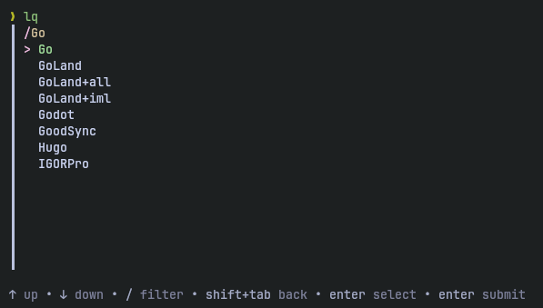
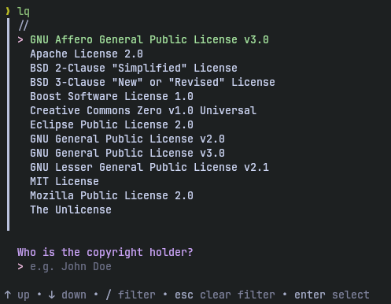

# lq
A CLI tool to add .gitignore and LICENSE to your projects right from your terminal

<!-- Badges -->
[](https://github.com/bakayu/lq/actions/workflows/CI.yml)
[](https://github.com/bakayu/lq/actions/workflows/release.yml)
[](./LICENSE)
[](https://github.com/bakayu/lq/releases/latest)


## Motivation
I wanted a simple CLI tool to generate `.gitignore` and `LICENSE` templates. I regularly forget to add these files and don’t want to do it manually. GitHub CLI (`gh repo new`) already asks about these, but its a command to init new repos, what about already initialized git repos? For this I built a focused tool just for `.gitignore` and `LICENSE` generation.

**Tech choice:** Go + Bubble Tea is the best fit here: minimal, clean, and fast for a TUI.

## Installation

**Install Script**

```bash
curl -sSL https://raw.githubusercontent.com/bakayu/lq/master/install.sh | bash
```

**Go install**

```bash
go install github.com/bakayu/lq/cmd/lq@latest
```

**From Releases**

- Download the latest binary from: https://github.com/bakayu/lq/releases/latest

## Usage

After installation just type in your terminal:

```sh
lq
```

[](https://asciinema.org/a/780438)

<details>

<summary>Screenshots</summary>

Invoking the CLI


Generating `.gitignore` templates



Generating `LICENSE` templates



</details>

## License
[MIT LICENSE](./LICENSE)
